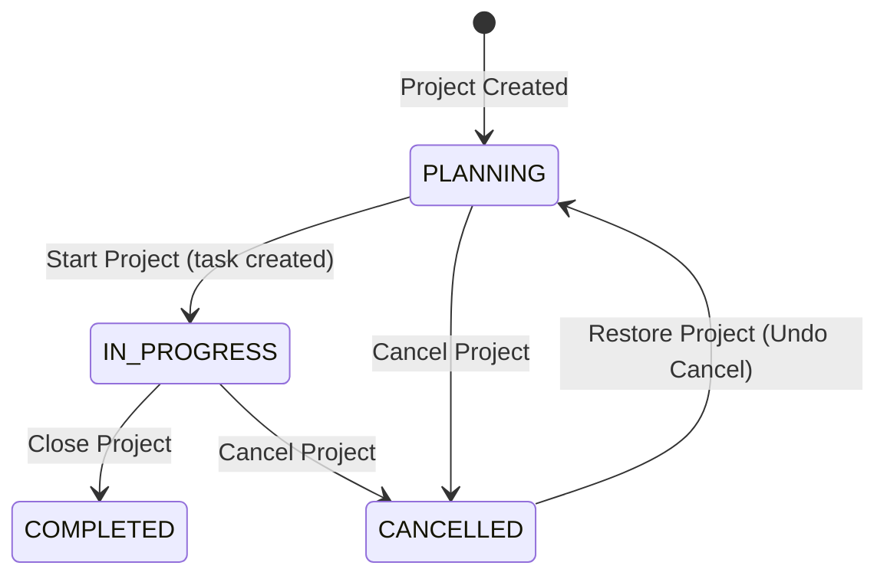

# BuildTrack Final Workflow Analysis

## Overview
**What the product does (from code):**
BuildTrack is a full-stack MVP application designed for construction workflow management. It provides a platform to manage users, roles, projects, tasks, clients, teams, and a versatile suite of construction-specific modules (CRM, Quoting, Job Confirmation, Support/Warranty, etc.).

**Main entities:**
- **User** (`users`): Mapped to Roles and Teams. Can log in, manage projects, and be assigned tasks.
- **Role / Permission** (`roles`, `permissions`, `role_permissions`): The RBAC foundation enforcing what actions users can perform on specific resources.
- **Client** (`clients`): The customer associated with Projects.
- **Project** (`projects`): Core tracking mechanism. Tracks jobs assigned to Managers and Users, progressing through states like PLANNING to COMPLETED.
- **Task** (`tasks`): "Work Orders" or sub-tasks attached to a Project.
- **ModuleRecord** (`module_records`): A generic JSON-schema-backed storage mechanism that powers dynamic views for leads, quotes, designs, and support tickets via `moduleSlug`.

**Key assumptions / limitations:**
- Currently, generic modules (`ModulePage.tsx`) drive a significant block of the features rather than bespoke tables. For example, "Support/Warranty" is stored generically in `module_records`.
- Notifications logic exists via an `AdminNotification` model, but email trigger hooks depend on simple `nodemailer` configurations which do primarily auth sequences right now.
- `OAuthAccounts` exist but are likely unlinked on the UI (marked as MVP TODO).

---

## Architecture Summary
**Frontend / Backend / Services**
- **Frontend** (`frontend/`): Next.js 14 App Router, using Tailwind CSS, shadcn/ui, and TanStack Query.
- **Backend** (`backend/`): Node.js/Express with TypeScript.
- **API Client** (`api/client.ts`): Wrapping `fetch` with strict endpoints map to connect standard CRUD.

**AuthN / AuthZ approach**
- **AuthN**: JWT token stored in `httpOnly` cookies via `POST /api/auth/login`. Sessions validated via `GET /api/auth/me`.
- **AuthZ**: Checked on backend via `requirePermission(action, resource)` middleware querying the `role_permissions` join table, and row-level checks like `requireProjectAccess()`. Checked on frontend via `canAccessModule(role, slug)` from `config/rbac.ts`.

**DB and background workers**
- PostgreSQL via Prisma ORM for relational persistence.
- Local execution relies on SQLite (`dev.db`). No external queuing system detected—email tasks trigger synchronously or run un-awaited during the request loop.

---

## Roles & Permissions

**The 12 System Roles:**
- `SUPER_ADMIN` / `ORG_ADMIN`: Full system access, manages users and settings.
- `PROJECT_MANAGER`: Oversees projects, coordinates teams, manages requirements.
- `SALES_MANAGER`: Manages leads, quotations, contracts, and client relationships.
- `PROJECT_COORDINATOR` (Designer): Creates layouts, selects materials.
- `PROCUREMENT_MANAGER`: Handles material planning, purchase orders.
- `PRODUCTION_MANAGER`: Handles manufacturing, assembly, packaging.
- `PLANNER`: Schedules production, planners and material resources.
- `QC_MANAGER`: Performs inspections, manages QC checklists.
- `LOGISTICS_MANAGER`: Schedules deliveries and installation.
- `FINANCE_MANAGER`: Manages billing, invoicing, payments.
- `CLIENT`: External customer, view-only to own orders, submits inquiries.
- `VENDOR`: Support/Vendor role, limited scope to inventory/POs.

**Permissions matrix table:**

| Role | Allowed Actions | Key Modules (Read/Write) |
| --- | --- | --- |
| Super/Org Admin | Bypass (All actions `*:*`) | All `/app/modules/*` |
| Project Manager | Edit assigned projects | Requirements, Configurator, Job Confirmation, Support |
| Sales Manager | CRM, Leads, Quotes | CRM / Leads, Quoting & Contracts |
| Designer (Coord.)| Project reqs, design | Project Requirements, Design Configurator |
| Prod. Manager | BOM, Manufacturing, QC | Manufacturing, Packaging, Work Orders |
| QC Manager | Quality Control | Quality Control (R/W), Manufacturing (R) |
| Procurement Mgr | BOM, Procurement | Procurement, BOM / Materials (R/W) |
| Planner | Prod Scheduling | Production Scheduling, BOM (R/W) |
| Logistics Mgr | Delivery, Closure | Delivery & Installation, Packaging (R) |
| Finance Manager | Quotes, Billing | Billing & Invoicing, Quoting & Contracts |
| Client | Restricted read/approval | Approval Workflow (R/W), Support (R) |

---

## Project Lifecycle

**States and transitions**

**Side effects per transition:**
- **Start Project** (UI: `frontend/src/app/app/projects/page.tsx` -> API: `POST /api/projects/:id/start`): Automatically sets status to `IN_PROGRESS` and creates the first Task ("CRM / Lead") as `TODO` assigned to the `assigneeId`.
- **Cancel Project** (API: `POST /api/projects/:id/cancel`): Updates status to `CANCELLED` and writes the `cancellationReason`.
- **Close Project** (API: `POST /api/projects/:id/close`): Status changes to `COMPLETED` and attaches an optional `completionNote`.
- **Restore Project** (API: `POST /api/projects/:id/restore`): Returns a `CANCELLED` project to `PLANNING` and nullifies the cancellation reason.

---

## Workflows by Role

### Admin / Org Admin 
**1. Login & Setup**
- Logs in. Navigates to `/admin/users` to assign custom roles to employees.
**2. Global Management**
- Has `*:*` bypass permission. Can view all projects (`/app/projects`) and manipulate assignments for any user.

### Project Manager
**1. Create & Review Project**
- Clicks "New Project" under `/app/projects`. Generates auto ID (`PRJ-123`).
**2. Execution**
- Clicks "Start Project" to start Phase 1. Task "CRM / Lead" generated.
- Can access and write to most generic modules like `/app/modules/project-requirements` or `/app/modules/work-orders`.

### Sales Manager
**1. Lead Creation & Quoting**
- Enters `/app/modules/crm-leads` to log customer inquiries.
- Creates quotes in `/app/modules/quoting-contracts`.

### Designer (Project Coordinator)
**1. Design Creation**
- Takes over post-quoting. Accesses `/app/modules/project-requirements`.
- Creates design layouts in `/app/modules/design-configurator`.

### Procurement Manager & Planner
**1. Material Planning & BOM**
- Planner schedules the work via `/app/modules/production-scheduling`.
- Procurement manages the BOM and Purchase Orders via `/app/modules/procurement`.

### Production Manager & QC Manager
**1. Manufacturing & Inspection**
- Production staff execute the assembly recorded in `/app/modules/manufacturing`.
- QC Manager conducts checks on finished goods in `/app/modules/quality-control` before packaging.

### Logistics Manager
**1. Delivery Scheduling**
- Receives packaged goods. Plans shipment in `/app/modules/delivery-installation`.

### Finance Manager
**1. Invoicing & Closure**
- Handles payments in `/app/modules/billing-invoicing`.
- Finalizes job costing during the Closure workflow (`/app/modules/closure`).

### Client / Subcontractor
**1. View & Approve**
- Has restricted views (enforced via `canAccessModule`).
- Approves quotes/designs via `/app/modules/approval-workflow`.

---

## Support Workflow
Unlike bespoke tables, Support and Warranties are dynamically handled by the `ModuleRecords` system.

1. **Accessing Support Module:**
   - A user navigates to `/app/modules/support-warranty`.
2. **Permission Check:**
   - Handled dynamically on frontend via `canAccessModule(role, "support-warranty")`.
   - Backend routes `/api/modules/support-warranty/records` map to `SLUG_TO_RESOURCE` verifying `work_orders` permissions on `requirePermission()`.
3. **Submitting a Ticket:**
   - The user fills out the generic JSON form.
   - Frontend calls `POST /api/modules/support-warranty/records`.
   - Backend saves to `ModuleRecord` table under `moduleSlug: "support-warranty"`.
4. **Resolution:**
   - Admin/PM views records via `GET /api/modules/support-warranty/records`.
   - Updates the JSON state (e.g. `{"status": "resolved"}`) via `PUT /api/modules/support-warranty/records/:id`.

---

## Testing Workflow Draft (QA Plan)

**Test Suites:**
- **Critical Path (Project Manager):** Verify a PM can create a project, assign it, start it, and update the auto-generated task to `DONE`.
- **Permission Boundary Tests:** 
  - Subcontractors attempting to call `POST /api/projects/:id/close` must yield `403 Insufficient permissions`.
  - Modules: Navigating to `/app/modules/finance` with a Subcontractor role must trigger frontend `Access Denied` and 403 on fetching records.
- **Negative Tests:** Missing `cancellationReason` via POST to cancel should yield `400 Validation Failed` from Zod.

**Example Test Cases (Given/When/Then):**
- **Given** an Active User with PM role, **When** they click "Start" on a project modal without selecting an `assigneeId`, **Then** the UI blocks submission, and if bypassed, the API returns a `ZodError 400 Validation failed`.
- **Given** a Subcontractor, **When** they visit `/app/modules/billing-invoicing`, **Then** the `canAccessModule` hook triggers a visual "Access Denied" state (`ShieldAlert` icon).

**Suggested Automation Approach:**
- Supertest / Jest integration testing against the REST endpoints covering RBAC bypass matrix and Zod input boundaries.
- Playwright E2E covering the `/app/projects` complex state transitions (Start, Cancel, Undo) and generic Module form mappings.

---

## Open Questions / Gaps
- Are the generic `ModuleRecord` components capable of uploading files/attachments? No file-specific endpoints exist inside `moduleRecords.routes.ts`. 
- Clients have a robust Schema (`Client`) but the workflow to invite them (`POST /api/teams/invite` supports `CLIENT` arg) relies on "TODO" email triggers—production emails must be set up via AWS SES or Resend in `.env`.
